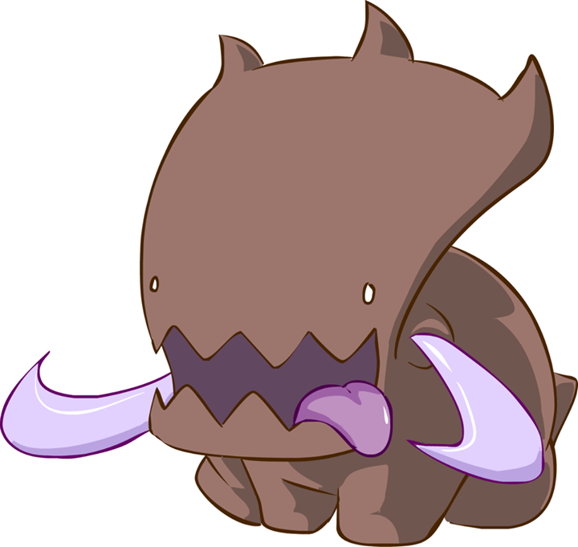

# Ultralisk - Starcraft: Brood War Bot

*image from [Carbot][Carbot]*

Ultralisk is a Starcraft: Brood War bot written in C++ on top of the [BWAPI][BWAPI] composed of two parts: 1) the actual AI (called Ultralisk) and 2) a neural network that creates stratagems (called Glaive). Using Glaive to decide on optimal build and unit composition after being trained on [replays][replays], Ultralisk seeks to accomplish a very modest goal of winning a majority of games against the built in Brood War AI. 

About Starcraft: Brood War
-----
Starcraft: Brood War is a real time strategy game originally released in 1998. Brood War's complexity has enabled it to become one of the most popular video games every played, despite having Starcraft II released as a sequel. Brood War has a very basic routine that can be easily summed in 3 steps:

1. Gather resources (called Minerals and Vespene Gas)
2. Spend resources to build an army composed of a variety of units
3. Use the army to attack and ultimately destroy the opponent's units and base.

The actual game is far more nuanced, but the 3 steps are sufficient as a *very* high level overview. 

Roadmap:
---
- [ ] Glaive build 0.0.1, **April 27** - Functioning Glaive, should be able to read and sufficiently analyze replays
- [ ] Glaive build 0.1, **April 28** - Glaive should be able to generate and output responses to opponent's actions, should be ready to be implemented into Ultralisk
- [ ] Ultralisk build 0.0.1, **April 30** - Ultralisk should be a semi-functioning form, should exhibit the ability to follow various build commands and unit attacks
- [ ] Ultralisk build 0.1, **May 1** - Ultralisk should be able to follow a specific build path, and be able to see what the opponent is building
- [ ] Ultralisk build 0.2, **May 2** - Ultralisk should be able to read from Glaive outputs
- [ ] Ultralisk build 0.3, **May 3** - Minimum Viable Product

Technology Stack
------
Ultralisk seeks to use the `CompleteMapInformation` flag within [BWAPI][BWAPI] to gain information through the fog of war without scouting (as scouting probably requires its own entire subroutine). By analysis of hundreds of [BW replays][replays] and passing them through [scikit-learn][scikit] in order to select optimal build paths, a good training set will be created. This training set will be fed into a Glaive in python (most likely based in [FANN][FANN] using batch backpropagation, along with decision trees), which will then generate base build orders and response patterns. These response patterns and build orders will then be collocated into Ultralisk itself.

Implementation Details
-----
- Agent - Ultralisk itself is an agent that interacts directly with the Starcraft: Brood War environment, through knowledge gained from Glaive.
- Environment - The Brood War gameplay environment
- Sensors - `CompleteMapInformation` will be enabled to avoid writing a complete scouting bot (this is definitely cheating the game a bit, possibly revisit this later on)
- Actions - Ultralisk itself has access to all actions a normal player would, which is to mine minerals, acquire gas, build units, etc. 
- Controller - The controller will be information created by Glaive itself
- Interaction & Analysis - Brood War itself generates replays, which can later be watched at another time to analyze how Ultralisk performs

Ultralisk Details:
----
TBD

Glaive Details:
---
TBD

[BWAPI]: https://github.com/bwapi/bwapi
[replays]: http://www.starcraftai.com/wiki/StarCraft_Brood_War_Data_Mining
[scikit]: http://scikit-learn.org/stable/
[FANN]: http://leenissen.dk/fann/wp/
[Carbot]: http://carbotstarcrafts.tumblr.com/