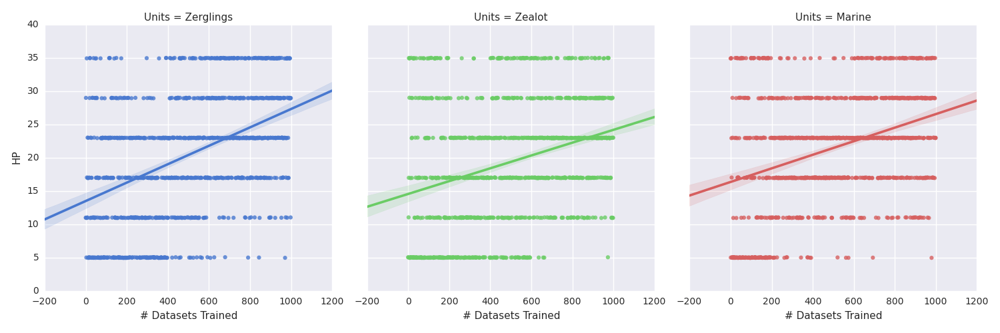

# Ultralisk - Starcraft: Brood War Bot - Optimized for Small Scale Combat

*Image from [Carbot][Carbot]*

## Paper Link - https://github.com/peixian/Ultralisk/blob/master/paper/paper.pdf

Ultralisk is a Starcraft: Brood War bot written in C++ on top of the [BWAPI][BWAPI] composed of two parts: 1) the actual AI (called Ultralisk) and 2) a neural network that creates stratagems (called Glaive). Using Glaive to decide on optimal build and unit composition after being trained on [replays][replays], Ultralisk seeks to accomplish a very modest goal of winning a majority of games against the built in Brood War AI. 

About Starcraft: Brood War
-----
Starcraft: Brood War is a real time strategy game originally released in 1998. Brood War's complexity has enabled it to become one of the most popular video games every played, despite having Starcraft II released as a sequel. Brood War has a very basic routine that can be easily summed in 3 steps:

1. Gather resources (called Minerals and Vespene Gas)
2. Spend resources to build an army composed of a variety of units
3. Use the army to attack and ultimately destroy the opponent's units and base.

The actual game is far more nuanced, but the 3 steps are sufficient as a *very* high level overview. 

# Ultralisk - Using Neural Networks for Small Scale Combat Optimization

Introduction
-----
A major issue for players and AI in real time strategy games is the individual control of units. For Starcraft, a major portion of it is finding the right places of engagement for combat, choosing effective places to position units before an engagement with the opponent is a vital part of Starcraft. Ultralisk seeks to improve upon basic decision making by creating a bot that focuses on proper positioning of units before an engagement. 

About Starcraft: Brood War
-----
Starcraft: Brood War is a real time strategy game originally released in 1998. Brood War's complexity has enabled it to become one of the most popular video games every played, despite having Starcraft II released as a sequel. Brood War has a very basic routine that can be easily summed in 3 steps:

1. Gather resources (called Minerals and Vespene Gas)
2. Spend resources to build an army composed of a variety of units
3. Use the army to attack and ultimately destroy the opponent's units and base.

The actual game is far more nuanced, but the 3 steps are sufficient as a *very* high level overview. 

About SparCraft
----
SparCraft is a tool built to simulate combat within Starcraft: Brood War. Because it can approximate combat to an extremely close degree, it was the chosen tool for Ultralisk to run its simulations in.

Hypothesis
----
By limiting Ultralisk to a small subset of units (melee ground units called Zerglings), Ultralisk should be able to find accurate deployment positions for its units.

Implementation Details
-----
- Agent - Ultralisk itself is an agent that interacts directly with the Starcraft: Brood War environment, through knowledge gained from Glaive.
- Environment - The Brood War gameplay environment along with the SparCraft environment
- Sensors - `CompleteMapInformation` will be enabled to avoid writing a complete scouting bot (this is definitely cheating the game a bit, possibly revisit this later on)
- Actions - Ultralisk itself has access to all actions a normal player would, which is to mine minerals, acquire gas, build units, etc. 
- Controller - The controller will be information created by Glaive itself, passed into [UAlbertaBot][UAlbertaBot]
- Interaction & Analysis - SparCraft generates combat data for analysis, and Brood War generates replays

Experimental Design
----
A map of size `1280 x 720` is created, where the left half is deployable by Ultralisk and the right half is deployable by the computer, as shown below:

Within this zone, Ultralisk can deploy 3 Zerglings: a fast moving melee unit with small amounts of HP (max 35). The computer can within its zone deploy 3 Marines: a slower moving melee unit with modest amounts of HP (max 50), 2 Zealots: a slow moving melee unit with a large amount of HP (max 100), or 3 Zerglings.

By generating hundreds of scenarios with various deployments by the computer, a subset of results can be obtained where Ultralisk won. These results are marked as successful and are then gathered into a dataset where a neural network is trained on them. Using backprop, this neural network can then generate where each Zergling should be placed. The neural network topology is shown below:

After proper results are computed, the data is fed back into Ultralisk for testing in Starcraft. 

Results
----
As the number of training epochs increased for the neural network, it began to show more complex deployment strategies, such as grouping multiple Zerglings together. A plot of the HP of the lowest living Zergling is shown below:

[UAlbertaBot]: https://github.com/davechurchill/ualbertabot
[BWAPI]: https://github.com/bwapi/bwapi
[replays]: http://www.starcraftai.com/wiki/StarCraft_Brood_War_Data_Mining
[scikit]: http://scikit-learn.org/stable/
[FANN]: http://leenissen.dk/fann/wp/
[Carbot]: http://carbotstarcrafts.tumblr.com/
[SparCraft]: https://github.com/davechurchill/ualbertabot/wiki/SparCraft-Home

Technology Stack
------
Ultralisk seeks to use the `CompleteMapInformation` flag within [BWAPI][BWAPI] to gain information through the fog of war without scouting (as scouting probably requires its own entire subroutine). Through the analysis of hundreds of small scale combat simulations in [SparCraft][SparCraft] and relearning through glaive, Ultralisk seeks to create an optimized deployment pattern for small scale combat. 

Implementation Details
-----
- Agent - Ultralisk itself is an agent that interacts directly with the Starcraft: Brood War environment, through knowledge gained from Glaive.
- Environment - The Brood War gameplay environment along with the SparCraft environment
- Sensors - `CompleteMapInformation` will be enabled to avoid writing a complete scouting bot (this is definitely cheating the game a bit, possibly revisit this later on)
- Actions - Ultralisk itself has access to all actions a normal player would, which is to mine minerals, acquire gas, build units, etc. 
- Controller - The controller will be information created by Glaive itself, passed into [UAlbertaBot][UAlbertaBot]
- Interaction & Analysis - SparCraft generates combat data for analysis, and Brood War generates replays

Roadmap:
---
- [x] Glaive build 0.0.1 - **April 27** - Functioning Glaive, should be able to read and sufficiently analyze replays
- [x] Glaive build 0.1 - **April 28** - Glaive should be able to generate and output responses to opponent's actions, should be ready to be implemented into Ultralisk
- [x] Ultralisk build 0.0.1 - **April 30** - Ultralisk should be a semi-functioning form, should exhibit the ability to follow various build commands and unit attacks
- [x] Ultralisk build 0.1 - **May 1** - Ultralisk should be able to follow a specific build path, and be able to see what the opponent is building
- [x] Ultralisk build 0.2 - **May 2** - Ultralisk should be able to read from Glaive outputs
- [x] Ultralisk build 0.3 - **May 3** - Minimum Viable Product

[UAlbertaBot]: https://github.com/davechurchill/ualbertabot
[BWAPI]: https://github.com/bwapi/bwapi
[replays]: http://www.starcraftai.com/wiki/StarCraft_Brood_War_Data_Mining
[scikit]: http://scikit-learn.org/stable/
[FANN]: http://leenissen.dk/fann/wp/
[Carbot]: http://carbotstarcrafts.tumblr.com/
[SparCraft]: https://github.com/davechurchill/ualbertabot/wiki/SparCraft-Home
